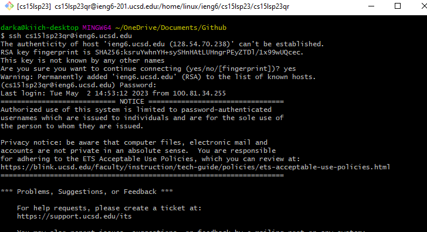
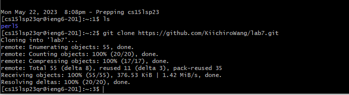
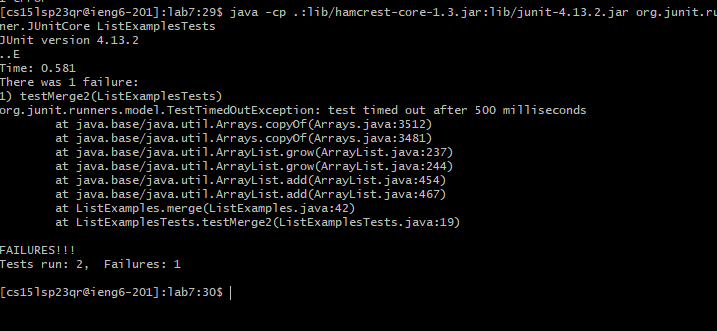
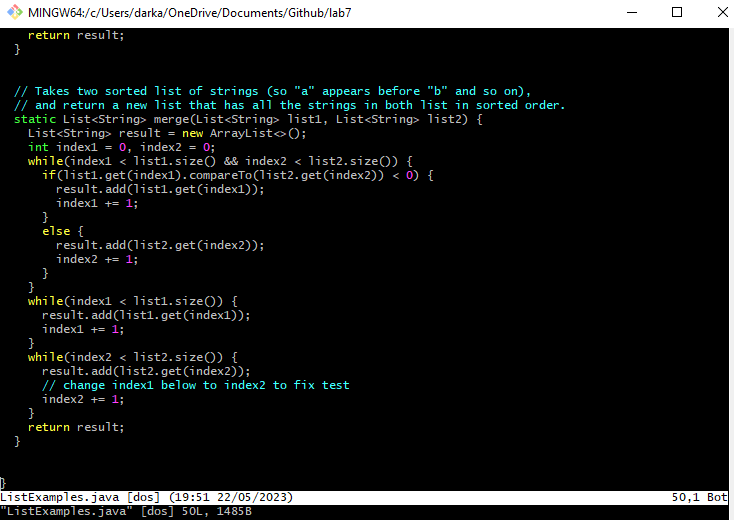
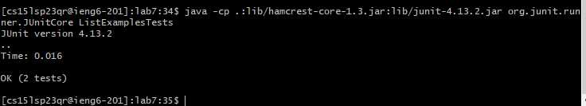
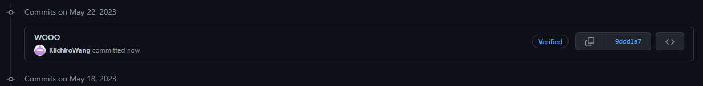

# Baseline Steps for Lab Report 4

1. **Completed Setup Steps**

2. **Login to ieng6**

  
  
  `<ssh cs15lsp23qr@ieng6.ucsd.edu><enter><entered password><enter>`
  Used the ssh command and my username and password credentials to login to the remote computer.
  
4. **Clone Fork**
  
  
  
  
  `<git clone><paste link><enter>`
  Pasted and cloned the forked repository into the directory.
  
5. **Ran Incorrect Tests**
    
    
  
    
  `<javac><paste junit library><*.java><enter>`
  Compiled all the .java files.
    
   `<java><paste junit library><ListExamplesTests><enter>`
   Ran the test files to see that they did not work.
    
6. **Edit Code**
       
       
  
   
  `<vim ListExamples.java><enter><up><up><up><up><up><up><up><up><up><up><i><right><right><right><right><right><right><backspace><2><escape><:><w><q><enter>`
  Entered the code and traversed to find the line with the incorrect code, then entered edit mode and fixed the line.
            
7. **Run Corrected Tests**
            
  
      
  `<javac><paste junit library><*.java><enter>`
  Compiled all the .java files.

  `<java><paste junit library><ListExamplesTests><enter>`
  Ran the test files to see that they now work.
            
8. **Github Commit & Push**

  
      
  `<git add .><git commit -m "Wooo"><git push origin main><username><password>`
  Git added, committed, then pushed everything to the online github repository.

